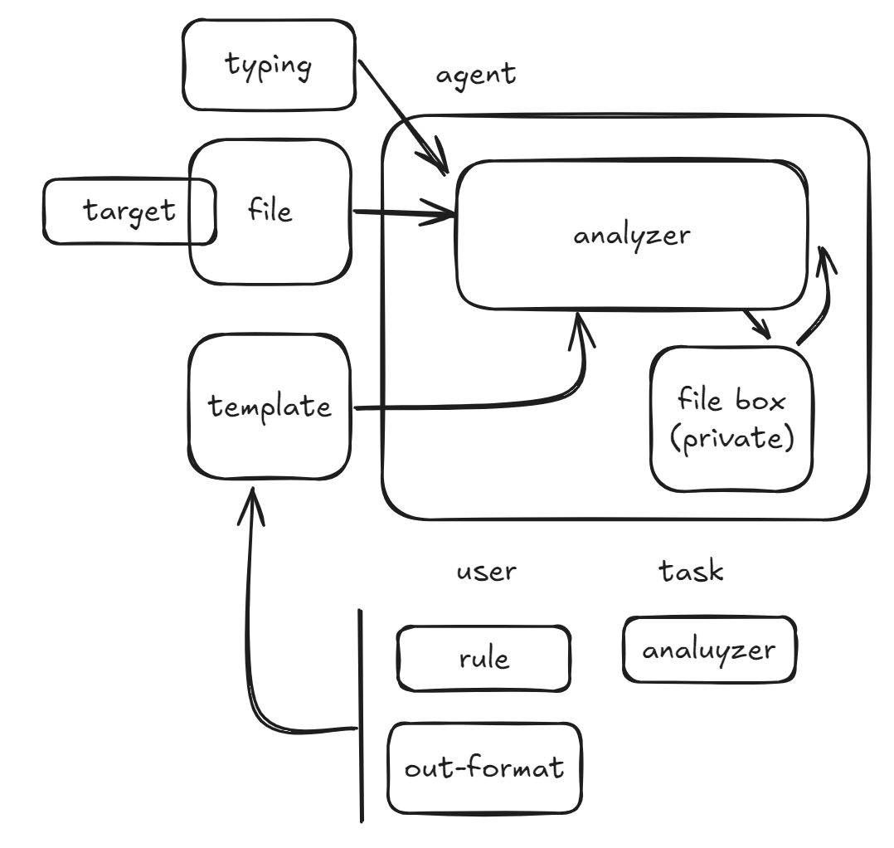

# 整体方案架构
- 提供笔记或目标记录文档上传到个人的目标资料夹[target]
- 记录本周工作细节，记录到记录资料夹[file_box]

# [agent_template]
# analyzer
- 根据本周记录归类到当前目标
- 整理本周主要内容，根据[user_template]制定输出内容

# [user_template] 
# 角色（rule）
- 根据角色关联的相关模板与配置

# 输出模板（out-format）
- 模板排版与信息关键抽取内容